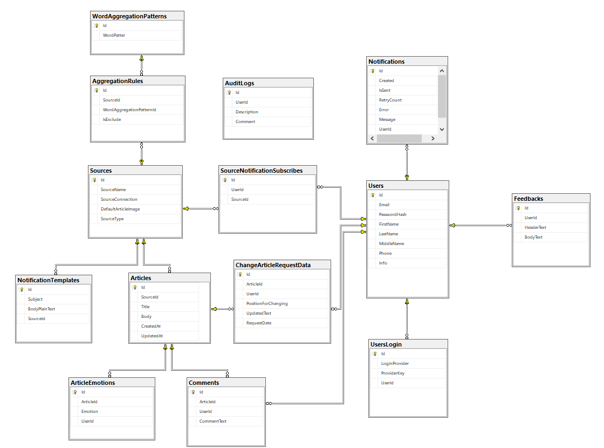

# Агрегатор хороших новостей

## Описание

Данное приложение позволяет извлекать динамически хорошие новости посредством RSS/Atom, а также из групп Telegram, и отображать на едином портале все данные новости с указанием источников

## Функциональные возможности

В данном портале предусматривается 3 роли: администратор, модератор и пользователь.

- Пользователи имеют возможность просматривать новости, подписываться на рассылку новостей, а также оставлять комментарии напротив новостей и реакции. Допольнительно у пользователей есть возможность оставлять обратную связь на портал для дальнейшей коммуникации с администрацией.
- Модератор имеет возможность управлять комментариями над новостями, а также оставлять запрос на редактировании статьи для корректировки содержимого (изменения рассматриваются администраторами).
- Администратор имеет возможность настраивать источники для извлечения новостей и задавать критерии, согласно которым будут извлекаться новости и устанавливать планировщики по частоте поиска новостей. Администратор имеет право на рассматривание фидбеков и заявок на изменения статей и имеет полный контроль над работой со статьями, источниками и пользователями (добавление\редактирование\удаление)

## Диаграмма базы 

Первый вариант базы отображена ниже.
В будущем возможно добавятся промежуточные параметры для отображения признака удаленного контента и активности\деактивности пользователя. 
Также для рассмотрения изменения возиожно добавятся параметры или отдельные таблицы (или же все действия для простоты будут фиксироваться в таблице AuditLogs)

